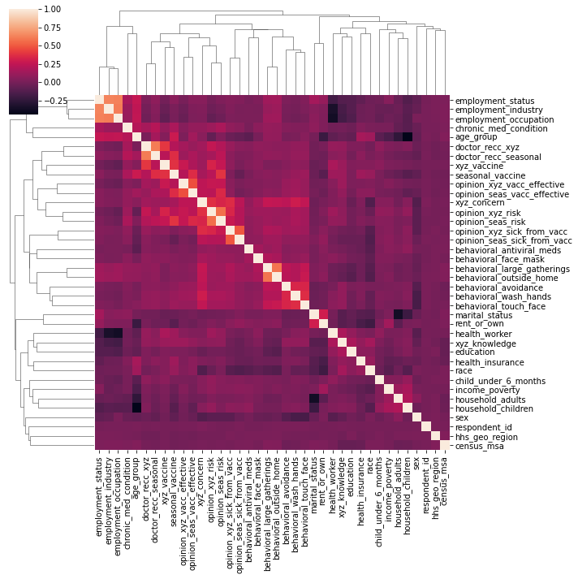
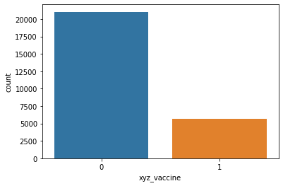
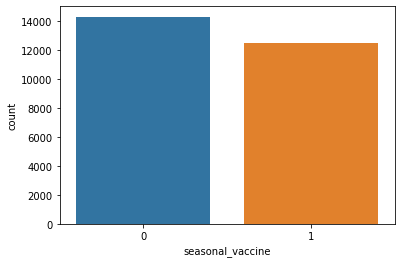
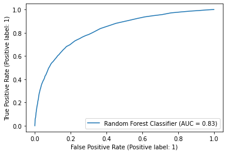
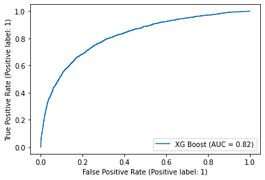

<h2> Problem Statement :</h2>

<h2> MULTILABEL VACCINE PROBAILITY PREDICTION </h2>

  <h3> LOADING DATASET ( TRAINING AND TESTING CSV ) </h3>

     - using pandas read_csv()

  <h3> EDA AND HANDLING MISSING VALUES </h3>

     - using df.isnull().sum() lists out no.of null values in each feature/column
     - out of 36 features given (30 features has missing values)
     - 36 feature also consist of different data types (int/float/object(string))
     - In most  of the binary features NULL value is replace by MODE since either of 1 class is dominant
     - Remaining Categorical Values are encoded using LabelEncoder from Scikit Learn
     - Each features is represented using sns.countplot() to visualize
     - Heatmap is plotted at the end to view correlation b/w different features 

  <h3>  Model </h3> 
     
     -  Before model selection test_train_split() to divide testing and training data with shuffle=True and stratified=True which improves random shuffling in the dataset
     - Total 5 models have been used

        - i)Logistic Regression
        - i)Bernoulli Naive bayes
        - i)SVM - RBF Kernel function
        - i)Random Forest
        - i)XGBoost

     - models are trained with only one label xyz_vaccine/h1n1_vaccine
     - since the model has high imbalance  for xyz_vaccine/h1n1_vaccine
           
     - model which performed good on this label can be used for prediction of another label ( seasonal_vaccine)
    - Generic code for any model implement using a scikit pipeline

    ```model_1 = make_pipeline(
        LogisticRegression(solver='sag') )
       model_1.fit(X_train_xyz, y_train_xyz)
       plot_roc_curve(model_1, X_test_xyz, y_test_xyz, name='logistic regression - xyz vaccine')
       plt.show()
    ```

   <h3> Evaluation </h3>
    -  By plotting roc_auc curve and comparing relative roc_auc_scores " Tree based model " outperformed in classification task than remaining models
    - Both Random forest and XGBoost gave roc_auc_score of "0.83" and "0.82" respectively.
            
      
<h3> Conclusion </h3>
    - Tree based models are best for this classification task , eventhough we have attained roc_score of 0.83 this can be improved a lot by detail Data preprocessing process using KNNImputer and Iterative Imputer instead of simple mode replacement (which may be computationally intensive but gives a better result)
